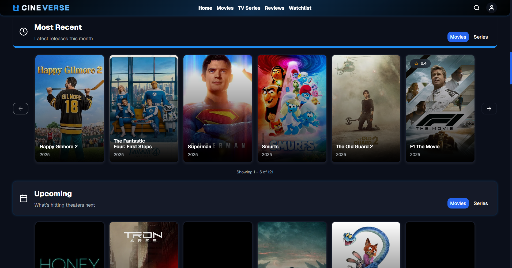

# CineVerse 🎬


---

**CineVerse** is a modern, feature-rich movie and TV series tracking application built with Next.js 15.  
It allows users to discover, track, and review their favorite movies and TV shows with a beautiful, responsive interface.

🚀 **SEO Optimized** – CineVerse achieves **100% SEO score on Google PageSpeed Insights**, ensuring top-notch discoverability and accessibility.  

🔗 [Live Preview](https://cineverse.social/) | 📂 [Backend Repository](https://github.com/MahmoudAbdulfattah1/CineVerse)



---

## ✨ Features

### 🔍 Content Discovery

- **Comprehensive Database**: Browse thousands of movies and TV series
- **Advanced Search**: Search by title, genre, year, rating, and language
- **Smart Filtering**: Filter content by multiple criteria simultaneously
- **Content Details**: Detailed information including cast, crew, trailers, and providers
- **Seasons & Episodes**: Full episode tracking for TV series

### 👤 User Management

- **Authentication System**: Secure user registration and login
- **Google OAuth**: Quick sign-in with Google account
- **Profile Management**: Customizable user profiles with profile pictures
- **Password Reset**: Secure password recovery system
- **Email Verification**: Account verification via email

### 📋 Watchlist Features

- **Personal Watchlist**: Add movies and TV shows to your watchlist
- **Watch Status**: Mark items as "To Watch" or "Watched"
- **Quick Actions**: Easy add/remove functionality with visual feedback
- **Watchlist Management**: Organize and manage your content library

### ⭐ Review System

- **Write Reviews**: Create detailed reviews with ratings (1-10 scale)
- **Spoiler Protection**: Mark reviews as containing spoilers
- **Review Interactions**: Like/dislike reviews from other users
- **Review Management**: Edit and delete your own reviews
- **Top Reviewers**: Discover the most active reviewers in the community

### 🎭 Cast & Crew

- **Detailed Profiles**: Comprehensive information about actors and directors
- **Filmography**: Complete list of person's work
- **Biography**: Detailed background information
- **Social Links**: Links to social media profiles

### 🎥 Media Features

- **Trailer Integration**: Watch trailers directly in the app
- **High-Quality Images**: Posters and backdrop images
- **Streaming Providers**: See where content is available to watch
- **IMDb Integration**: Ratings and data from IMDb

### 🎨 User Experience

- **Dark Theme**: Beautiful dark interface with blue accents
- **Responsive Design**: Optimized for desktop, tablet, and mobile
- **Smooth Animations**: Engaging micro-interactions and transitions
- **Loading States**: Skeleton screens for better perceived performance
- **Toast Notifications**: User-friendly feedback messages

---

## 🛠️ Tech Stack

### Frontend

- **Framework**: [Next.js 15](https://nextjs.org/) (App Router)
- **Language**: [TypeScript](https://www.typescriptlang.org/)
- **Styling**: CSS Modules with custom CSS variables
- **State Management**: [TanStack Store](https://tanstack.com/store)
- **Data Fetching**: [TanStack Query](https://tanstack.com/query) (React Query)
- **Form Handling**: Custom hooks with validation
- **Icons**: Custom SVG icon system
- **Animations**: CSS animations and transitions

### Authentication & Security

- **JWT Tokens**: Secure authentication with HTTP-only cookies
- **OAuth**: Google OAuth2 integration
- **Password Hashing**: Secure password handling
- **Protected Routes**: Client and server-side route protection

### Development Tools

- **TypeScript**: Full type safety
- **Custom Fonts**: Geist and Inter font families
- **Environment Variables**: Secure configuration management

---

## 🚀 Getting Started

### Prerequisites

- Node.js 18+
- pnpm (recommended) or npm
- Backend API server running

### Installation

1. **Clone the repository**

   ```bash
   git clone https://github.com/yourusername/cineverse.git
   cd cineverse
   ```

2. **Install dependencies**

   ```bash
   pnpm install
   ```

3. **Environment Setup**
   Create a `.env.local` file in the root directory:

   ```env
   NEXT_PUBLIC_API_BASE_URL=YOUR_API_BASE_URL_HERE
   NEXT_PUBLIC_SITE_URL=YOUR_SITE_URL_HERE
   NEXT_PUBLIC_GOOGLE_ANALYTICS_ID=YOUR_GOOGLE_ANALYTICS_ID_HERE
   ```

4. **Run the development server**

   ```bash
   pnpm dev
   ```

5. **Open your browser**
   Navigate to [http://localhost:3000](http://localhost:3000)

### Building for Production

```bash
pnpm build
pnpm start
```

## 📁 Project Structure

```
cineverse/
├── app/                             # Next.js 15 App Router
│   ├── (App)/                       # Main application routes
│   │   ├── (Auth)/                  # Authentication pages
│   │   │   ├── login/               # Login page
│   │   │   ├── register/            # Registration page
│   │   │   └── forget-password/     # Password reset
│   │   ├── (Home)/                  # Home page
│   │   ├── [slug]/                  # Dynamic content pages
│   │   ├── crew/                    # Cast & crew pages
│   │   ├── explore/                 # Content discovery
│   │   ├── profile/                 # User profiles
│   │   ├── reviews/                 # Reviews section
│   │   ├── search/                  # Search functionality
│   │   └── watchlist/               # Watchlist management
│   ├── api/                         # API routes
│   │   ├── auth/                    # Authentication endpoints
│   │   ├── content/                 # Content-related APIs
│   │   ├── proxy/                   # Proxy endpoints
│   │   ├── reviews/                 # Review management
│   │   ├── user/                    # User management
│   │   └── watchlist/               # Watchlist APIs
│   └── layout.tsx                   # Root layout
├── components/                      # React components
│   ├── cards/                       # Card components
│   ├── layout/                      # Layout components
│   ├── pages/                       # Page-specific components
│   ├── shared/                      # Shared components
│   └── ui/                          # UI components
├── hooks/                           # Custom React hooks
├── lib/                             # Utility libraries
├── constants/                       # Constants and types
├── styles/                          # Global styles
├── utils/                           # Utility functions
└── public/                          # Static assets
```

---

## 🎯 Key Features Deep Dive

### Authentication System

- **Secure Login/Register**: Full authentication flow with validation
- **Google OAuth**: One-click social login
- **JWT Management**: Secure token handling with HTTP-only cookies
- **Password Security**: Forgot password and reset functionality

### Content Management

- **Dynamic Routing**: SEO-friendly URLs for all content
- **Rich Media**: Trailers, images, and streaming provider information
- **Detailed Information**: Cast, crew, ratings, and comprehensive metadata
- **Season/Episode Tracking**: Full TV series support

### User Interactions

- **Watchlist Management**: Add, remove, and organize content
- **Review System**: Write, edit, and interact with reviews
- **Rating System**: 10-point rating scale with visual feedback
- **Social Features**: Like/dislike reviews, view top reviewers

### Performance Optimizations

- **Server-Side Rendering**: Fast initial page loads
- **Image Optimization**: Next.js Image component with lazy loading
- **Code Splitting**: Automatic code splitting for better performance
- **Caching**: Strategic caching with React Query
- **Skeleton Loading**: Better perceived performance

---

## 🎨 Design System

### Color Palette

- **Primary**: Blue (#3B82F6)
- **Background**: Dark theme with multiple surface levels
- **Text**: White with various opacity levels for hierarchy
- **Accent Colors**: Warning, success, and error states

### Typography

- **Primary Font**: Geist
- **Secondary Font**: Inter
- **Font Scales**: Responsive typography with CSS custom properties

### Components

- **Consistent UI**: Reusable component library
- **Animations**: Smooth transitions and micro-interactions
- **Responsive**: Mobile-first design approach

### Custom Hooks

- `useAuthMutations`: Authentication operations
- `useWatchlistMutations`: Watchlist management
- `useReviewMutations`: Review operations
- `useResponsiveLayout`: Responsive design utilities
- `useIsInView`: Intersection observer wrapper

---

## 📱 Responsive Design

CineVerse is fully responsive and optimized for:

- **Desktop**: Full-featured experience with sidebar layouts
- **Tablet**: Optimized layouts with touch-friendly interactions
- **Mobile**: Streamlined interface with mobile-specific navigation

---

## 🛡️ Security Features

- **JWT Authentication**: Secure token-based authentication
- **HTTP-Only Cookies**: Protection against XSS attacks
- **Input Validation**: Client and server-side validation
- **Protected Routes**: Authentication guards for sensitive pages

---

## 🚀 Performance Features

- **Server-Side Rendering**: Fast initial page loads
- **Static Generation**: Pre-generated pages where possible
- **Image Optimization**: Automatic image optimization and lazy loading
- **Code Splitting**: Automatic bundle splitting
- **Prefetching**: Link prefetching for instant navigation

---

## 🤝 Contributing

We welcome contributions! Please see our [Contributing Guide](CONTRIBUTING.md) for details.

---

## 📄 License

This project is licensed under the MIT License - see the [LICENSE](LICENSE) file for details.

---

## 👥 Authors

- **[Wael Gamil](https://www.linkedin.com/in/wael-gamil/)** - Frontend Developer
- **[Mahmoud Abdelfattah](https://www.linkedin.com/in/mahmoud-a-fattah)** - Backend Developer

---

## 🙏 Acknowledgments

- [The Movie Database (TMDb)](https://www.themoviedb.org/) for movie and TV data
- [Next.js](https://nextjs.org/) for the amazing React framework
- [TanStack](https://tanstack.com/) for excellent data fetching and state management
- The open-source community for inspiration and tools

---

## 📞 Support

If you have any questions or need help, please:

- Open an issue on GitHub
- Contact us via email
- Check our documentation

---

**CineVerse** - Explore the universe of film and series—beautifully presented. 🎬✨
